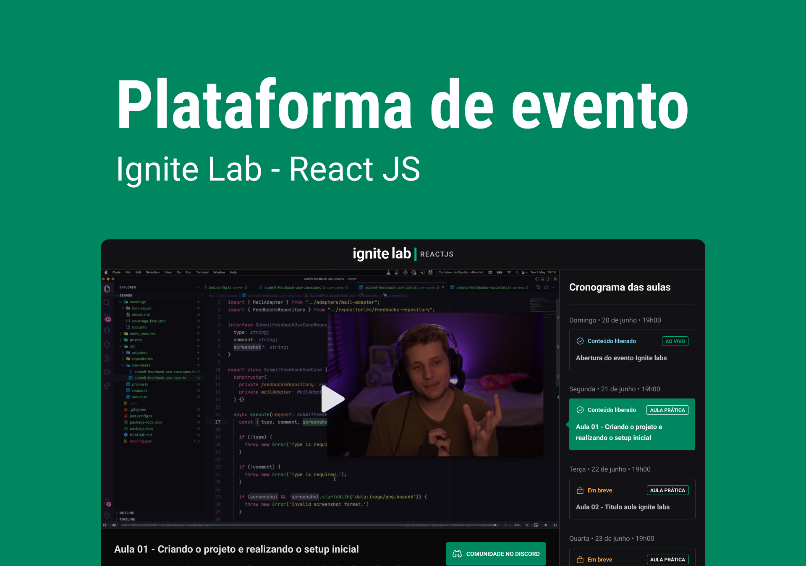

# NLW Ignite-Lab-React JS

## Plataforma de evento
Uma página de cadastro de e-mails com uma plataforma para um evento virtual

___

## Tecnologias 💻

-   [React](https://reactjs.org)
-   [Vite](https://vitejs.dev/)
-   [React Router DOM](https://www.npmjs.com/package/react-router-dom)
-   [Tailwind CSS](https://tailwindcss.com/)
-   [Apollo GraphQL](https://www.apollographql.com/)
-   [Phosphor Icons](https://phosphoricons.com/)
-   [date-fns](https://date-fns.org/)
-   [Vime](https://vimejs.com/)
-   [GraphQL Code Generator](https://www.graphql-code-generator.com/)

___
